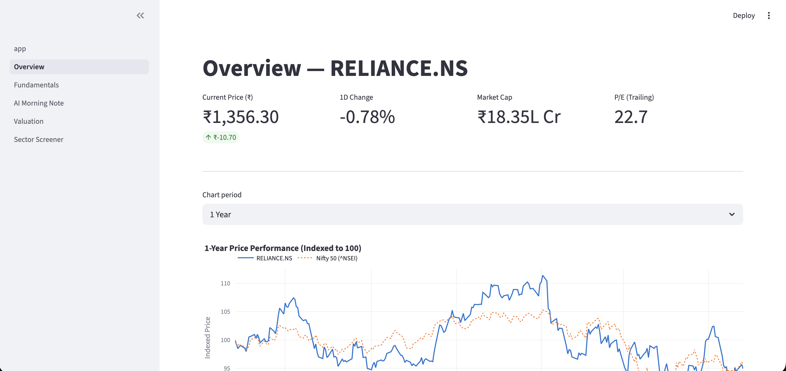
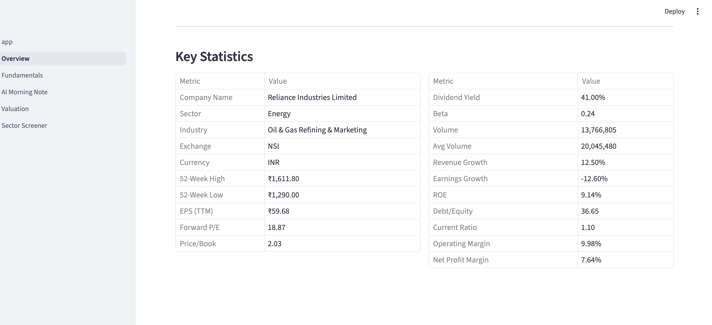
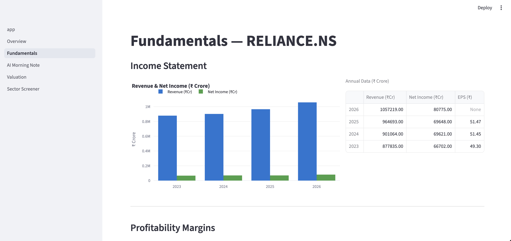
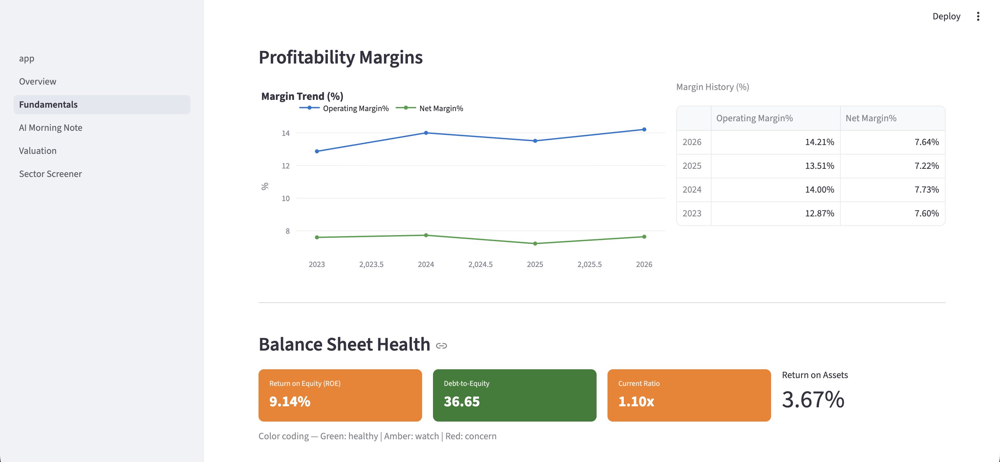
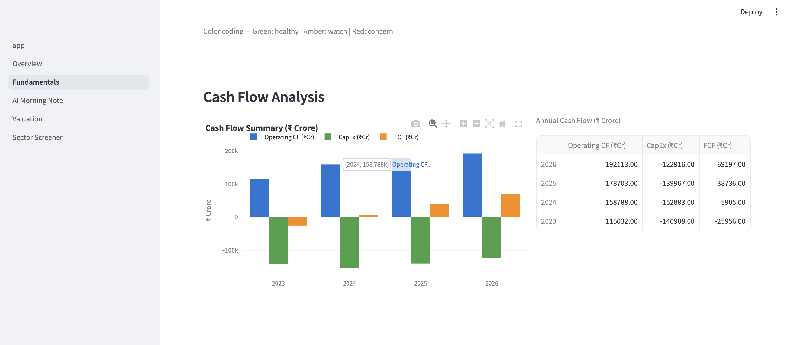
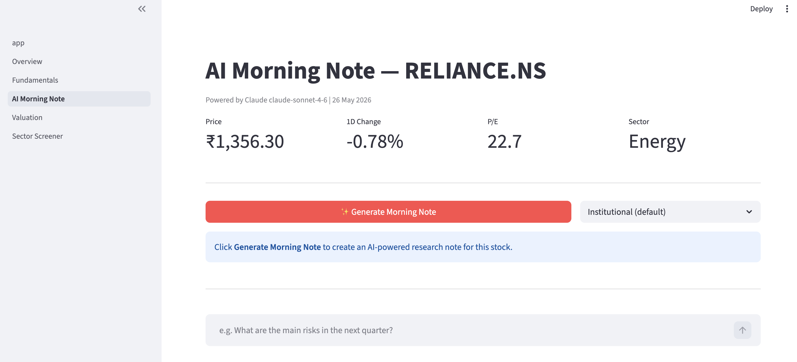
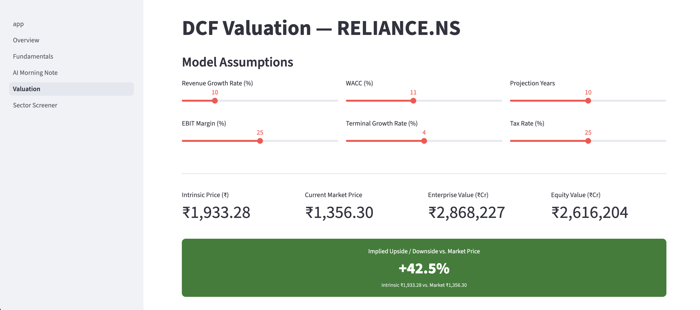
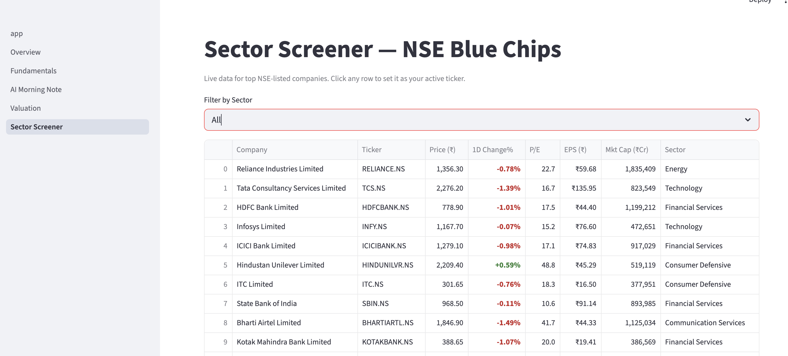

# India Stock Analyzer 📈

A web app that gives you institutional-quality stock research on any NSE/BSE listed company — live prices, financial statements, AI-generated research notes, DCF valuation, and a sector screener, all in one place.

Built with Python and Streamlit. No coding knowledge needed to use it once it's running.

---

## Screenshots

| Overview — Live Price & Chart | Overview — Key Statistics |
|:---:|:---:|
|  |  |

| Fundamentals — Income Statement | Fundamentals — Margins & Balance Sheet |
|:---:|:---:|
|  |  |

| Fundamentals — Cash Flow | AI Morning Note |
|:---:|:---:|
|  |  |

| DCF Valuation | Sector Screener |
|:---:|:---:|
|  |  |

---

## What does this app do?

Type any Indian stock ticker (like `RELIANCE.NS` or `TCS.NS`) and the app instantly gives you:

- A live price chart comparing the stock against Nifty 50
- Income statement, profit margins, and cash flow trends
- An AI-written morning research note (like what a broker sends to fund managers)
- An interactive DCF valuation model where you control the assumptions
- A live screener comparing 15 top NSE blue-chip stocks side by side

---

## Pages at a glance

### 1. Overview
The first thing you see when you enter a ticker.

- **Live price card** — current price, day's change (₹ and %), market cap, and trailing P/E
- **1-year price chart** — the stock indexed to 100 alongside Nifty 50, so you can instantly see whether the stock beat or lagged the market
- **Volume bars** — daily trading volume in green (up day) and red (down day)
- **Key statistics table** — 20+ metrics including 52-week high/low, EPS, dividend yield, beta, ROE, debt/equity, operating margin, and more

You can switch the chart between 1 month, 3 months, 6 months, 1 year, 2 years, and 5 years using the dropdown.

---

### 2. Fundamentals
Four years of financial history for the stock.

- **Income Statement** — Revenue, Net Income, and EPS as a grouped bar chart and table. Immediately shows whether the company is growing or shrinking.
- **Profitability Margins** — Operating Margin % and Net Profit Margin % as a line chart over 4 years. Flat or falling margins are a warning sign.
- **Balance Sheet Health** — Three colour-coded health indicators:
  - Return on Equity (ROE) — how efficiently the company uses shareholder money
  - Debt-to-Equity — how leveraged the balance sheet is
  - Current Ratio — whether the company can pay its short-term bills
  - Green = healthy, Amber = watch, Red = concern
- **Cash Flow Analysis** — Operating cash flow, CapEx, and Free Cash Flow as a bar chart. FCF is the real money a business generates after spending on growth.

---

### 3. AI Morning Note
This page uses Claude (Anthropic's AI) to write a professional equity research note — the kind a senior analyst at a brokerage would send to portfolio managers each morning.

- **Generate Morning Note** — click the button and Claude streams a full structured note in real time, covering:
  - **Top Call** — BUY / HOLD / SELL with a one-line thesis and target price
  - **Overnight Developments** — relevant macro or sector news
  - **Key Metrics at a Glance** — valuation, growth, margins, and balance sheet in a table
  - **Trade Idea** — entry zone, stop-loss, and target price with rationale
  - **Risks** — 2–3 specific risks that could invalidate the thesis
  - **Analyst Note** — a paragraph a CEO would find useful before a board meeting
- **Q&A Chat** — after the note is generated, ask follow-up questions about the stock and Claude answers in context
- **Download PDF** — export the research note as a formatted PDF report

Requires an Anthropic API key (free to get, instructions below).

---

### 4. Valuation (DCF Model)
An interactive Discounted Cash Flow model. DCF is the standard method fund managers use to calculate what a stock is *actually worth* based on its future cash flows.

- **Six sliders** to control the model assumptions:
  - Revenue Growth Rate — how fast you expect the company to grow
  - EBIT Margin — expected operating profitability
  - WACC — your required rate of return (cost of capital)
  - Terminal Growth Rate — long-run growth after the projection period
  - Projection Years — how many years to model (5–15)
  - Tax Rate
- **Intrinsic value vs. market price** — the app tells you whether the stock is overvalued or undervalued based on your assumptions, and by how much (% upside/downside shown in a colour-coded banner)
- **Waterfall chart** — visually breaks down how PV of cash flows + terminal value builds up to the equity value
- **Sensitivity table** — a matrix showing the implied price across a range of WACC and terminal growth combinations, colour-coded green (above market price) and red (below)

---

### 5. Sector Screener
A live comparison table of 15 top NSE blue-chip stocks across sectors.

- Columns: Company, Sector, Price, 1-day change %, P/E ratio, EPS, Market Cap
- Positive changes are shown in green, negative in red
- **Filter by sector** — Banking, IT, Pharma, Energy, FMCG, Telecom
- **Switch active ticker** — select any stock from the screener and set it as your active ticker with one click, then navigate to Overview or Fundamentals to deep-dive into it
- Summary stats at the bottom: total stocks shown, number of gainers vs. losers, average P/E

---

## How to run it on your laptop

### Step 1 — Check that Python is installed

Open your Terminal (Mac) or Command Prompt (Windows) and type:

```
python3 --version
```

If you see something like `Python 3.10.x` or higher, you're good. If you get an error, download Python from [python.org/downloads](https://www.python.org/downloads/) and install it. Make sure to tick **"Add Python to PATH"** during installation on Windows.

---

### Step 2 — Download the project

If you have Git installed:

```bash
git clone https://github.com/YOUR_USERNAME/india-stock-analyzer.git
cd india-stock-analyzer
```

Or download the ZIP from GitHub (green "Code" button → "Download ZIP"), unzip it, and open Terminal in that folder.

---

### Step 3 — Install the required packages

In your Terminal, with the project folder open, run:

```bash
pip install -r requirements.txt
```

This installs everything the app needs (Streamlit, data libraries, AI libraries, etc.). It may take 1–2 minutes. You only need to do this once.

> **Tip for Mac users:** if `pip` doesn't work, try `pip3` instead.

---

### Step 4 — Get your Anthropic API key (for the AI features)

The AI Morning Note page needs an API key from Anthropic. It's free to get:

1. Go to [console.anthropic.com](https://console.anthropic.com) and create a free account
2. Click **API Keys** in the left sidebar
3. Click **Create Key**, give it a name, and copy the key (it starts with `sk-ant-`)

---

### Step 5 — Add your API key to the project

In the project folder, create a file called `.env` (note the dot at the start) and add this line:

```
ANTHROPIC_API_KEY=sk-ant-your-key-here
```

Replace `sk-ant-your-key-here` with the actual key you copied.

> **On Mac:** the easiest way is to open Terminal in the project folder and run:
> ```bash
> cp .env.example .env
> ```
> Then open `.env` in any text editor (TextEdit, VS Code, etc.) and paste your key.

---

### Step 6 — Run the app

```bash
streamlit run app.py
```

Your browser will open automatically at `http://localhost:8501`. If it doesn't, open your browser and go to that address manually.

---

### Step 7 — Use the app

1. Type a stock ticker in the sidebar — use the `.NS` suffix for NSE stocks (e.g. `RELIANCE.NS`, `TCS.NS`, `HDFCBANK.NS`, `INFY.NS`)
2. Navigate between pages using the sidebar menu
3. Click **Refresh Data** in the sidebar to get the latest prices

#### Common NSE tickers to try

| Company | Ticker |
|---------|--------|
| Reliance Industries | `RELIANCE.NS` |
| TCS | `TCS.NS` |
| HDFC Bank | `HDFCBANK.NS` |
| Infosys | `INFY.NS` |
| Wipro | `WIPRO.NS` |
| Bajaj Finance | `BAJFINANCE.NS` |
| Maruti Suzuki | `MARUTI.NS` |
| ITC | `ITC.NS` |

For BSE stocks, use `.BO` instead of `.NS` (e.g. `RELIANCE.BO`).

---

## Deploying online (Streamlit Community Cloud)

If you want to share the app with others via a public URL:

1. Push this repo to your GitHub account (do **not** include your `.env` file — it's already excluded)
2. Go to [share.streamlit.io](https://share.streamlit.io) and sign in with GitHub
3. Click **New app**, select your repo, and set the main file to `app.py`
4. Under **Advanced settings → Secrets**, add:
   ```toml
   ANTHROPIC_API_KEY = "sk-ant-your-key-here"
   ```
5. Click **Deploy** — the app will be live at a public URL in about a minute

---

## Project structure (for developers)

```
india-stock-analyzer/
├── app.py                     # Entry point — sidebar and home page
├── pages/
│   ├── 1_Overview.py          # Live price, charts, key statistics
│   ├── 2_Fundamentals.py      # Financial statements, margins, cash flow
│   ├── 3_AI_Morning_Note.py   # Claude API morning note, Q&A, PDF export
│   ├── 4_Valuation.py         # Interactive DCF model and sensitivity table
│   └── 5_Sector_Screener.py   # Live NSE blue-chip screener
├── core/
│   ├── fetcher.py             # All yfinance data calls (cached 5 min)
│   ├── ratios.py              # Financial ratio calculations
│   ├── dcf.py                 # DCF model logic (pure Python, no Streamlit)
│   └── ai_analyst.py         # Claude API streaming integration
├── reports/
│   └── pdf_builder.py         # PDF report generation via ReportLab
├── .env.example               # Template for environment variables
└── requirements.txt           # Python package dependencies
```

---

## Built with

| Tool | What it does |
|------|-------------|
| [Streamlit](https://streamlit.io) | Turns Python scripts into a web app |
| [Claude API (claude-sonnet-4-6)](https://www.anthropic.com) | AI-generated research notes and Q&A |
| [yfinance](https://github.com/ranaroussi/yfinance) | Free live NSE/BSE stock data |
| [Plotly](https://plotly.com/python/) | Interactive charts |
| [ReportLab](https://www.reportlab.com) | PDF report generation |
| [pandas / numpy](https://pandas.pydata.org) | Data processing and calculations |

---

## Troubleshooting

**"Module not found" error when running `streamlit run app.py`**
Run `pip install -r requirements.txt` again. Make sure you're in the right folder.

**"ANTHROPIC_API_KEY not set" warning on the AI page**
Your `.env` file is either missing or the key isn't saved correctly. Re-read Step 5 above.

**Stock data shows "N/A" for some fields**
Some smaller or less liquid stocks have incomplete data on yfinance. Try a major index stock like `RELIANCE.NS` or `TCS.NS` to confirm the app is working.

**App opens but the page is blank**
Wait a few seconds — the first data fetch can take up to 10 seconds. If it stays blank, click **Refresh Data** in the sidebar.

---

> **Disclaimer:** This tool is for informational and educational purposes only. It does not constitute investment advice. Always consult a SEBI-registered investment advisor before making investment decisions.
